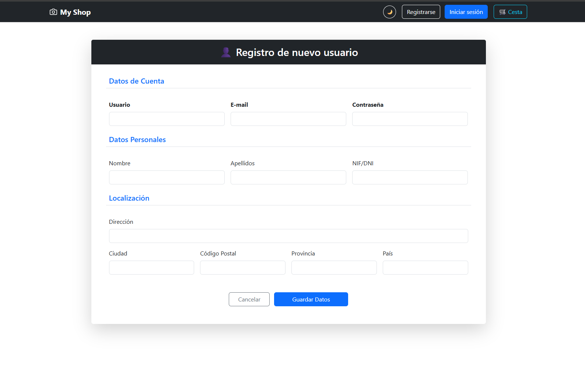
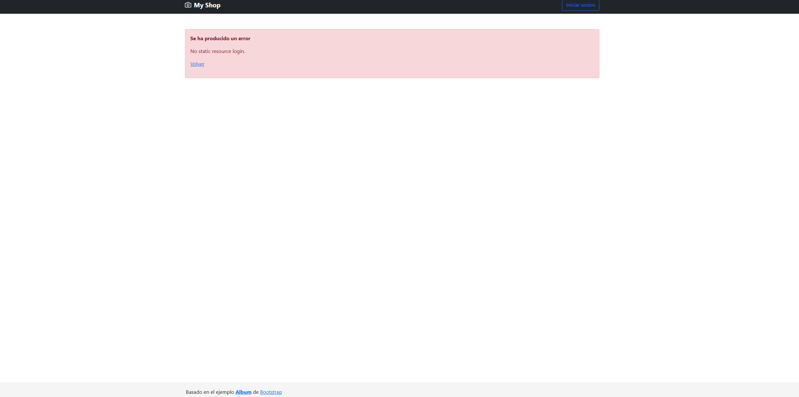
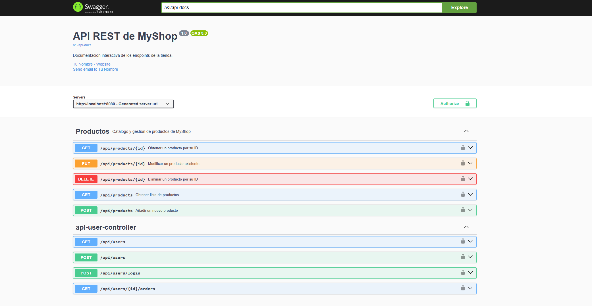
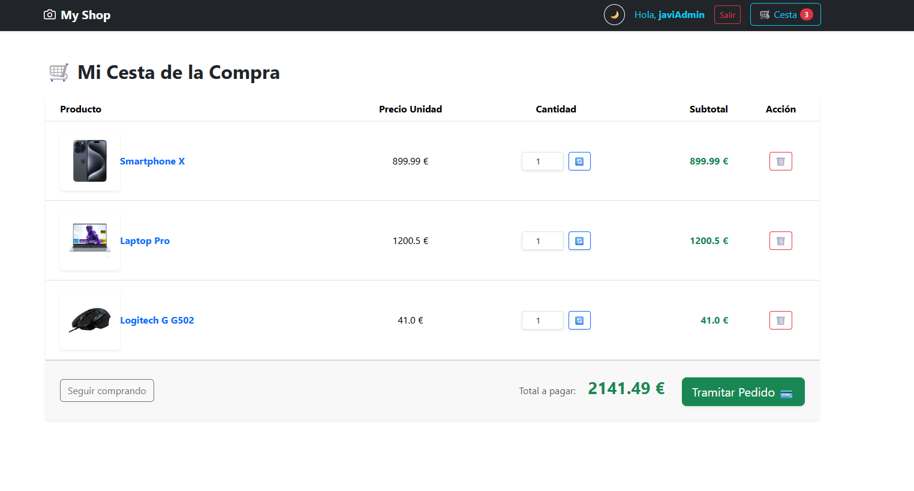
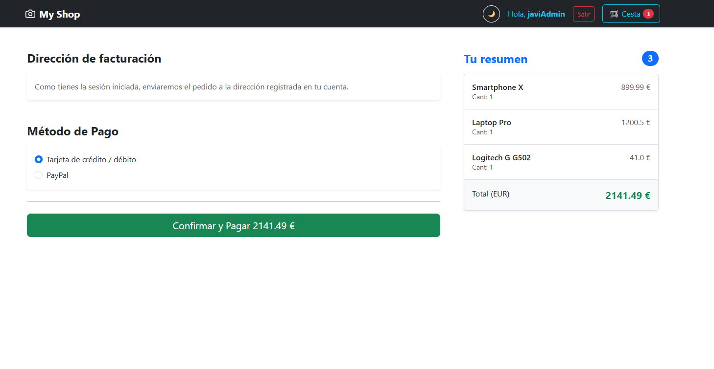
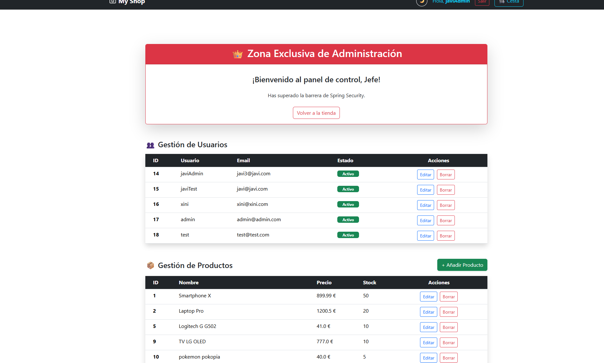

# 🛒 MyShop - E-Commerce Spring Boot Application

Una aplicación de comercio electrónico completa desarrollada con **Spring Boot 3** y **Java**.

Este proyecto ha evolucionado desde una interfaz web básica hasta convertirse en una arquitectura backend robusta, implementando estándares profesionales de seguridad, persistencia de datos y procesamiento automatizado.

## 🚀 Características Principales

### 🛡️ Seguridad y Autenticación
* **Spring Security:** Protección integral de las rutas de la aplicación.
* **JSON Web Tokens (JWT):** Sistema de autenticación *stateless* para el inicio de sesión de los usuarios, garantizando accesos seguros y escalables.
* **Roles de Usuario:** Diferenciación entre administradores y clientes.

### ⚙️ Arquitectura Backend y Procesamiento
* **Spring Batch:** Implementación de un flujo de trabajo (Reader, Processor, Writer) para la importación masiva de catálogos de productos a través de archivos `.csv`.
* **Automatización de Tareas (@Scheduled):** Sistema de "reloj interno" configurado mediante expresiones CRON para ejecutar tareas de mantenimiento de forma periódica.
* **Interceptores Globales:** Monitorización de tráfico mediante un `RequestLoggingInterceptor` que registra automáticamente datos clave (IP, método HTTP, ruta) de cada petición entrante.

### 💾 Base de Datos
* **Spring Data JPA & Hibernate:** Mapeo objeto-relacional (ORM) para interactuar con la base de datos de forma limpia.
* **MySQL:** Motor de base de datos relacional para persistir entidades como Usuarios, Roles, Productos y Pedidos.

### 🌐 Frontend (Server-Side Rendering)
* **Thymeleaf:** Motor de plantillas para la renderización de vistas dinámicas.
* **Internacionalización (i18n):** Soporte bilingüe (Español / Inglés) adaptado a las preferencias del usuario.
* **Manejo de Errores Personalizado:** Páginas de error amigables (ej. 404, 500) para mejorar la experiencia del usuario.

---

## 📸 Capturas de Pantalla


> *Vista del catálogo de productos con soporte bilingüe.*


> *Formulario de registro seguro para nuevos usuarios.*


> *Ejemplo de nuestra página de error personalizada.*


> *Documentación interactiva de la API REST generada automáticamente con Swagger UI (OpenAPI).*


> *Ejemplo de nuestra página de Cesta de la compra personalizada.*


> *Ejemplo de nuestra página de pasarela de pago personalizada.*


> *Ejemplo de nuestra página de Administrador personalizada.*


---

## 🛠️ Stack Tecnológico

* **Core:** Java, Spring Boot 3
* **Seguridad:** Spring Security, JWT (io.jsonwebtoken)
* **Datos:** Spring Data JPA, MySQL Driver, Spring Batch
* **Vista:** Thymeleaf
* **Herramientas:** Lombok, Maven

---

## 💻 Instalación y Ejecución Local

1. **Clonar el repositorio:**
   ```bash
   git clone [https://github.com/tu-usuario/tu-repositorio.git](https://github.com/tu-usuario/tu-repositorio.git)
   
2. **Configurar la base de datos:**
Asegúrate de tener MySQL corriendo en el puerto 3306. Modifica el archivo application.properties con tus credenciales:

Properties
spring.datasource.url=jdbc:mysql://localhost:3306/myshop
spring.datasource.username=tu_usuario
spring.datasource.password=tu_contraseña

3. **Ejecutar la aplicación:**
   Puedes compilar y ejecutar el proyecto usando Maven:

Bash
mvn clean package -DskipTests
java -jar target/demo-0.0.1-SNAPSHOT.jar

4. Acceso:
   Abre tu navegador y dirígete a http://localhost:8080.
